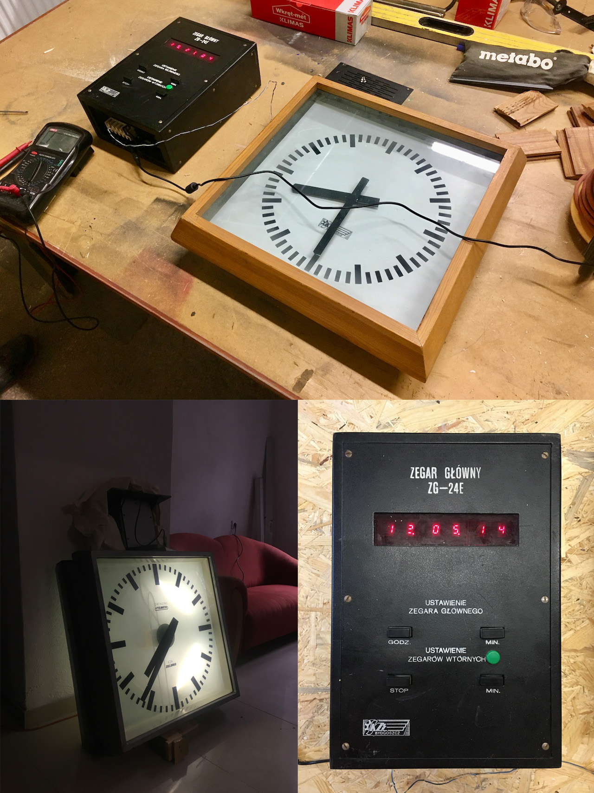

# zegary
Zegary dworcowe KZŁ Bydgoszcz i KZA Zielonka Chronopas Polmatik z zegarem sterującym ZG-24E.
24V 2A.

Przydatne linki: 

https://www.elektroda.pl/rtvforum/topic1667129.html#8197655

https://majsterkowo.pl/sterownik-zegarow-wtornych-pkp/

https://baur.pl/zegar-wtorny-i-jego-sterowanie/

http://ciemny.lhs.pl/2020/02/23/railway-clock-driver/

Wypożyczone bezterminowo przez A. L.
